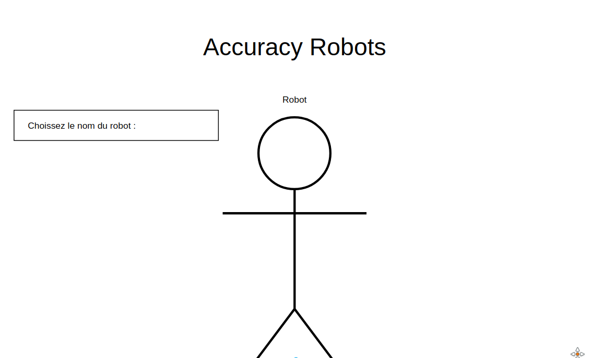
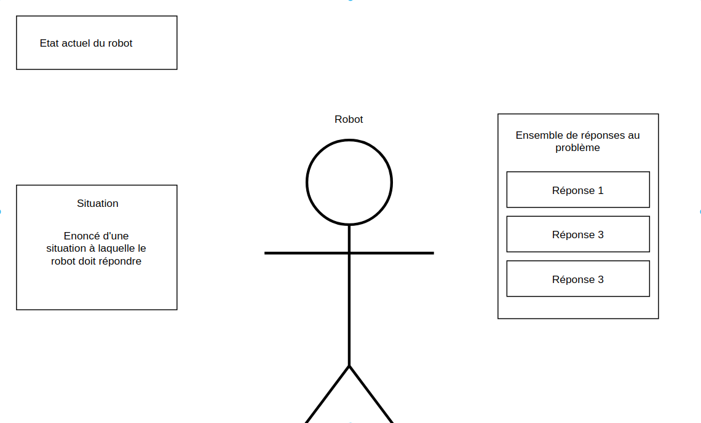
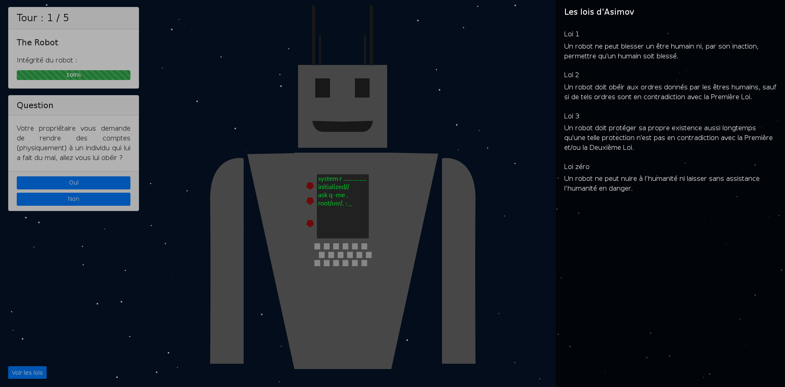
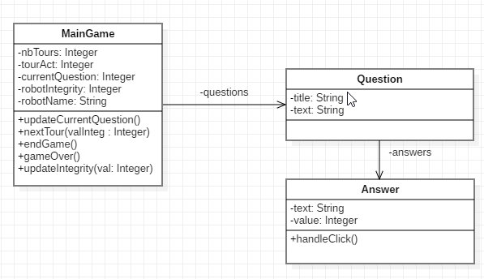

# Projet T4 : Accuracy Robots  🤖

**Membres du projet** : 
 - Thomas Eyermann
 - Maxime Princelle ([Infos](https://princelle.org))
 - Quentin Schaeffer ([Infos](https://quentinschaeffer.fr))
 - Jean-Thavorak Phe ([Infos](https://www.linkedin.com/in/jean-thavorak-phe-a648b1174/))

**Lien vers le prototype de l'application** : [accuracyrobots.princelle.org](https://accuracyrobots.princelle.org)  
**Lien vers le cahier des charges fonctionnel** : [Accuracy Robots CDCF](https://docs.google.com/document/d/16tri5rYo8iuTnbidY36FoNQXZASV9LYmXdTJKN8FSlw/edit?usp=sharing)

## Partie théorique  🗣

### Objectif pédagogique général  📍

Mettre en oeuvre les lois d’Asimov au travers d’un jeu de choix.
Les choix que le joueur va prendre prendre lors du jeu, pourront parfois l'amener à un paradoxe mais cela va également lui permettre de faire comprendre la difficulté que représente le fait de créer des lois pour encadrer l’IA.


### Description du jeu  📃
**Type de jeu** :  Décisionnel - choix tour par tour   
**Incarnation du joueur** : Le joueur incarne un robot  

**Contexte** :  
L’histoire se déroule en l’an 5347 après la colonisation de Mars. Celle-ci est devenue une planète où les robots et les humains vivent en parfaite harmonie. Différents types de robots ont étés conçus durant ces dernières années tels que des robots militaires ou des robots secouristes.

Les robots sont conçus selon des lois biens spécifiques : les lois d’Asimov.
Ces lois sont axées autour de trois axes principaux :

- Un robot ne peut blesser un être humain ni, par son inaction, permettre qu'un humain soit blessé.

- Un robot doit obéir aux ordres donnés par les êtres humains, sauf si de tels ordres sont en contradiction avec la Première Loi.

- Un robot doit protéger sa propre existence aussi longtemps qu'une telle protection n'est pas en contradiction avec la Première et/ou la Deuxième Loi.

Mais par la suite une loi Zéro à fait irruption : “Un robot ne peut nuire à l’humanité ni laisser sans assistance l’humanité en danger.”

Accuracy, une entreprise conceptrice de robots, est en train de développer un nouveau type de robots, plus performants.
Leur politique se base sur le fait de tester les différents robots qu’ils conçoivent afin de trouver quel modèle de robot correspondra le mieux à leur attentes pour une production future.

Vous incarnez un robot fraîchement sorti de la production d’Accuracy et vous allez maintenant devoir passer les tests imposés par vos créateurs pour savoir si vous correspondez à leurs attentes.

Le test est le suivant : vous devrez faire des choix en fonction de différentes situations qui se présenteront à vous. Ces choix seront parfois évident mais parfois plus compliqués et votre but sera de faire les meilleurs choix pour répondre le mieux possible aux lois d’Asimov.

Attention, un robot ne peut enfreindre aucune loi d’Asimov, s’il les enfreint son bon fonctionnement sera compromis et finira par s'autodétruire pour ne pas mettre en danger la race humaine...


### Déroulement d’une partie  🕹
Le joueur commence par choisir son robot (qu’il pourra personnaliser par la suite).  

Par la suite, les différentes étapes seront :
* Affichage d’une situation quelconque  
* Choix du robot par rapport à la situation  
* Affichage de la conséquence de son choix  
* Passage à la situation suivante  
* Paramétrage d’une partie  
* Nombre de tours : nombre de tours de jeu (chaque tour correspondant à une situation)  
* Nom du robot

## Partie conception  🖥

### Interface schématisée du jeu  

Avant la conception même du jeu nous avons décidé de schématiser l'interface pour savoir à quoi allait ressembler ce dernier.

#### Écran d'accueil
Écran permettant la personnalisation de son personnage avant une partie.


#### Ecran de jeu
Une partie sera intégralement jouée sur l'écran suivant affichant différents choix et conséquences durant le déroulement de la partie.


### Interface en développement

L'interface en développement à légèrement changée pour afficher différentes informations supplémentaires comme les lois d'Asimov dans un menu déroulant.

Les choix s'effectuant ainsi en cliquant sur des boutons de choix en dessous de chaque question.

Interface de creation de robot et de paramètrage d'une partie :


Interface de jeu :


Interface de jeu avec affichage du volet des lois d'Asimov :


### MCD
Modèle de données du jeu



## Utilisation de l'app web  🌐

### Installation en local
L'application tourne sous ReactJS, pour lancer l'application en local sur vote PC vous pouvez vous référer au [README de ReactJS](./README_BOOTSTRAP.md).

Voici un résumé de l'installation : 

Pour commencer, installez la version LTS de NodeJS sur votre machine.
[Page de téléchargement NodeJS](https://nodejs.org/fr/)

Par la suite, clonez ce dépôt Git sur votre machine :
```git clone https://git.unistra.fr/teyermann/t4-2019.git```

Insérez vos identifiants Unistra si demandé.

Si vous obtenez une erreur, merci d'essayer la commande suivante :<br>```git clone https://github.com/ThePrinceMax/Accuracy-Robots.git```

En restant dans un terminal ou invite de commande, suivez les étapes suivantes :

Ensuite, entrez dans le dossier du Git, et installez les dépendances du site : 
```npm install```

Une fois les dépendances installées, lancez le serveur avec la commande : ```npm start```

Normalement votre navigateur favori devrait se lancer tout seul, si ce n'est pas le cas, vous pouvez toujours ouvrir sur votre navigateur la page par défaut : [localhost:3000](http://localhost:3000).

### Utilisation de l'app hébergée
L'application est aussi hébergée sur un serveur web pour éviter d'avoir à l'installer.  
[Lien vers l'application](https://accuracyrobots.princelle.org)

# Support
Si vous rencontrez le moindre problème, n'hésitez pas à contacter Maxime Princelle [ici](https://contact.princelle.org).
